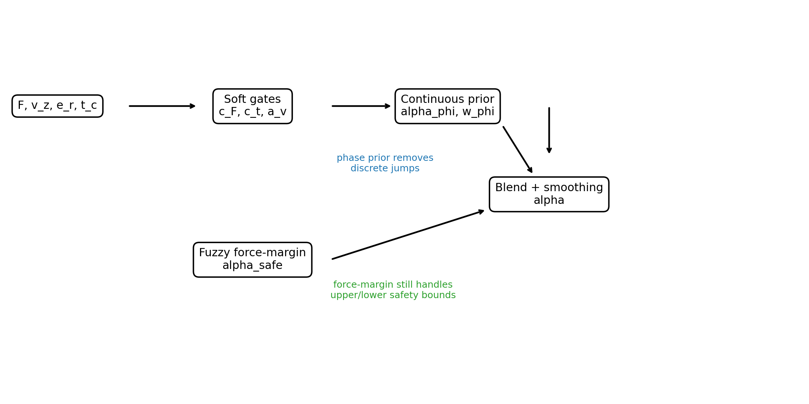
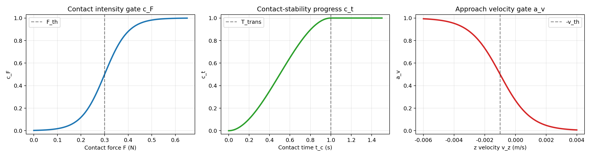
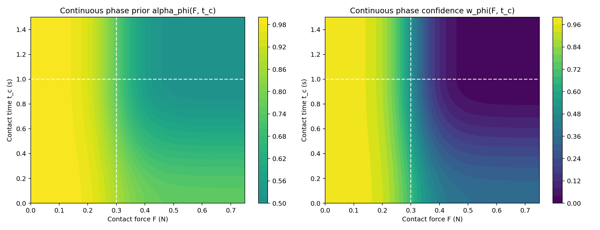
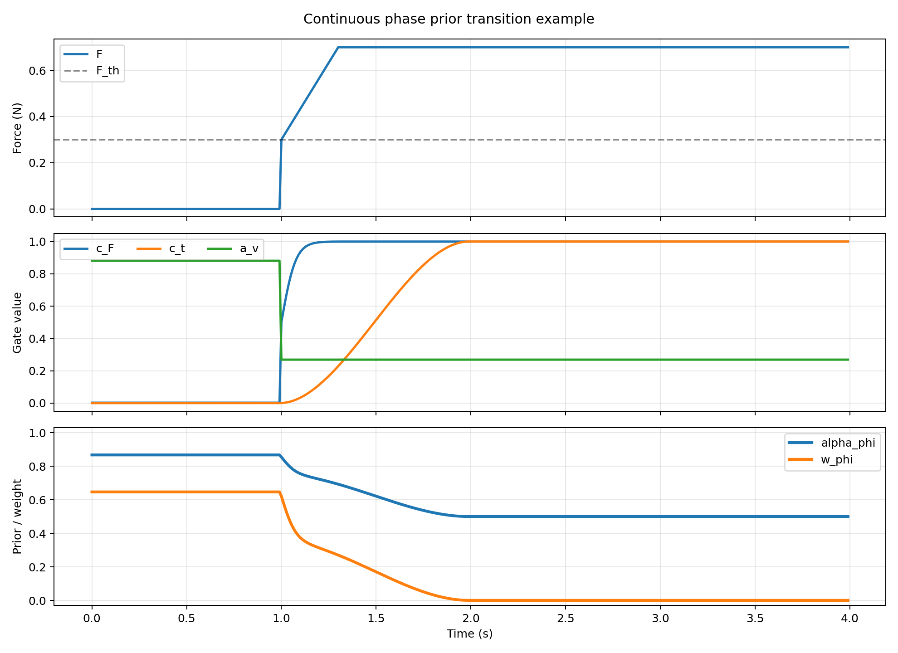

# 连续阶段先验 Force-Margin 仲裁方案

<style>
body,
.markdown-body {
    background: #ffffff !important;
    color: #111111;
}
</style>

本文档给出一种新的 `ForceMarginFuzzyAlphaScheduler` 仲裁改进方案：将原先基于离散阶段表的阶段先验参数：

```text
(alpha_phi, w_phi) = phase_table[phase]
```

改为连续函数：

```math
\alpha_\phi = \alpha_\phi(F, v_z, t_c)
```

```math
w_\phi = w_\phi(F, v_z, t_c)
```

其中：

| 符号 | 含义 |
|---|---|
| `F` | 当前接触力范数 |
| `v_z` | tool z 方向速度 |
| `t_c` | 连续接触持续时间 |
| `alpha_phi` | 阶段先验仲裁值 |
| `w_phi` | 阶段先验置信权重 |

新的目标是：保留 `force_margin` 基于力安全上下界的优势，同时消除 `FREE_SPACE -> APPROACHING -> CONTACT_TRANSIENT -> CONTACT_STEADY` 之间的离散跳变，降低接触瞬态下 `alpha` 突变导致的力峰值和位置振荡。



## 1. 原离散阶段先验的问题

当前离散阶段先验写作：

```python
FORCE_MARGIN_PHASE_PARAMS = {
    TaskPhase.FREE_SPACE:        (1.0,  1.0),
    TaskPhase.APPROACHING:       (0.85, 0.6),
    TaskPhase.CONTACT_TRANSIENT: (0.65, 0.25),
    TaskPhase.CONTACT_STEADY:    (0.50, 0.0),
    TaskPhase.RETREAT:           (1.0,  1.0),
}
```

阶段融合公式为：

```math
\alpha_{raw}
=
w_\phi \alpha_\phi
+
(1-w_\phi)\alpha_{safe}
```

其中 `alpha_safe` 是 `ForceMarginFuzzyAlphaScheduler` 经过模糊推理和上下界安全修正得到的仲裁结果。

离散阶段先验的问题在于：当阶段检测器从一个阶段切换到另一个阶段时，`alpha_phi` 和 `w_phi` 会发生阶跃变化。例如：

```text
APPROACHING       -> CONTACT_TRANSIENT
(0.85, 0.60)     -> (0.65, 0.25)
```

或：

```text
CONTACT_TRANSIENT -> CONTACT_STEADY
(0.65, 0.25)      -> (0.50, 0.00)
```

虽然最终 `alpha` 又经过一阶低通滤波，但阶段先验本身仍是分段常值，这会在接触建立和接触稳定之间引入不连续的控制权重变化。

## 2. 连续阶段先验的核心思想

新的方案不再把阶段看作互斥离散状态，而是用三个连续门控变量描述系统状态：

```math
c_F \in [0,1]
```

```math
c_t \in [0,1]
```

```math
a_v \in [0,1]
```

分别表示：

| 门控变量 | 含义 |
|---|---|
| `c_F` | 接触强度，描述当前力是否已超过接触阈值 |
| `c_t` | 接触稳定进度，描述接触持续时间是否已越过瞬态 |
| `a_v` | 接近运动强度，描述自由空间中是否正在向下接近 |

这三个连续门控替代离散阶段索引，用平滑函数生成 `alpha_phi` 和 `w_phi`。



## 3. 接触强度门控 `c_F`

定义接触力阈值：

```math
F_{th} = 0.3\ \mathrm{N}
```

定义力过渡带宽：

```math
\Delta F = 0.05\ \mathrm{N}
```

接触强度门控为 sigmoid 函数：

```math
c_F(F)
=
\sigma
\left(
\frac{F-F_{th}}{\Delta F}
\right)
```

其中：

```math
\sigma(x)=\frac{1}{1+e^{-x}}
```

解释：

```text
F << F_th: c_F -> 0，自由空间
F ~= F_th: c_F 平滑过渡
F >> F_th: c_F -> 1，接触状态
```

相较于硬阈值：

```text
F >= F_th
```

连续门控能避免接触力在阈值附近抖动时引起阶段频繁跳变。

## 4. 接触稳定进度 `c_t`

定义接触持续时间：

```math
t_c(k+1)=
\begin{cases}
t_c(k)+dt, & F \ge F_{th} \\
0, & F < F_{th}
\end{cases}
```

定义瞬态持续时间：

```math
T_{trans}=1.0\ \mathrm{s}
```

接触稳定进度采用三次 smoothstep：

```math
c_t
=
S
\left(
\frac{t_c}{T_{trans}}
\right)
```

其中：

```math
S(s)=
\begin{cases}
0, & s \le 0 \\
3s^2-2s^3, & 0 < s < 1 \\
1, & s \ge 1
\end{cases}
```

smoothstep 的端点导数为零：

```math
S'(0)=0,\quad S'(1)=0
```

因此从接触瞬态到稳态的过渡不会产生斜率突变。

解释：

```text
c_t ~= 0: 刚接触，仍处于接触瞬态
c_t ~= 1: 接触已持续足够时间，可认为进入稳态接触
```

## 5. 接近运动门控 `a_v`

为了区分自由空间静止和自由空间下降接近，引入 z 方向速度门控。

定义：

```math
v_{th}=0.001\ \mathrm{m/s}
```

```math
\Delta v=0.001\ \mathrm{m/s}
```

接近运动门控为：

```math
a_v(v_z)
=
\sigma
\left(
\frac{-v_z-v_{th}}{\Delta v}
\right)
```

解释：

```text
v_z < -v_th: tool 正在向下接近，a_v -> 1
v_z >= -v_th: tool 未明显向下运动，a_v -> 0
```

## 6. 自由空间/接近阶段的连续先验

未接触时，阶段先验由 `a_v` 在自由空间和接近阶段之间插值。

自由空间建议：

```math
\alpha_{free}=1.00,\quad w_{free}=1.00
```

接近阶段建议：

```math
\alpha_{approach}=0.85,\quad w_{approach}=0.60
```

则预接触先验为：

```math
\alpha_{pre}
=
(1-a_v)\alpha_{free}
+
a_v\alpha_{approach}
```

```math
w_{pre}
=
(1-a_v)w_{free}
+
a_v w_{approach}
```

展开为：

```math
\alpha_{pre}
=
(1-a_v)\cdot 1.00 + a_v\cdot 0.85
```

```math
w_{pre}
=
(1-a_v)\cdot 1.00 + a_v\cdot 0.60
```

含义：

```text
自由空间静止或撤退：强位置优先
向下接近：仍以位置为主，但逐渐给 force-margin 留出影响空间
```

## 7. 接触阶段的连续先验

接触后，阶段先验由 `c_t` 在接触瞬态和稳态接触之间平滑插值。

接触瞬态建议：

```math
\alpha_{trans}=0.75,\quad w_{trans}=0.35
```

稳态接触建议：

```math
\alpha_{steady}=0.50,\quad w_{steady}=0.00
```

则接触阶段先验为：

```math
\alpha_{contact}
=
(1-c_t)\alpha_{trans}
+
c_t\alpha_{steady}
```

```math
w_{contact}
=
(1-c_t)w_{trans}
+
c_t w_{steady}
```

展开为：

```math
\alpha_{contact}
=
(1-c_t)\cdot 0.75 + c_t\cdot 0.50
```

```math
w_{contact}
=
(1-c_t)\cdot 0.35 + c_t\cdot 0.00
```

含义：

```text
刚接触时：仍保留一定阶段先验，防止模糊仲裁过激
接触稳定后：w_phi -> 0，完全交给 force-margin 安全模糊仲裁
```

## 8. 预接触与接触状态的连续融合

最后用接触强度 `c_F` 在预接触先验和接触先验之间插值：

```math
\alpha_\phi
=
(1-c_F)\alpha_{pre}
+
c_F\alpha_{contact}
```

```math
w_\phi
=
(1-c_F)w_{pre}
+
c_Fw_{contact}
```

这就是新的连续阶段先验。

它的输入是连续的，输出也是连续的：

```math
(F, v_z, t_c)
\mapsto
(\alpha_\phi, w_\phi)
```

下图展示了当 `v_z=0` 时，`alpha_phi` 和 `w_phi` 随接触力 `F` 与接触时间 `t_c` 的连续曲面。



## 9. 与 Force-Margin 模糊安全仲裁的融合

`ForceMarginFuzzyAlphaScheduler` 原本已经计算：

```math
\alpha_{safe}
```

其中 `alpha_safe` 来自：

1. 力误差幅值 `F_h`
2. 力安全裕度 `S_h`
3. 位置安全度 `D_r`
4. Mamdani 模糊推理
5. 上下界方向安全修正

新的连续阶段先验不替代 `alpha_safe`，而是替代原来的离散表：

```text
phase_params[phase]
```

融合公式保持不变：

```math
\alpha_{raw}
=
w_\phi \alpha_\phi
+
(1-w_\phi)\alpha_{safe}
```

区别在于：

```text
旧方案: alpha_phi 和 w_phi 是阶段表查表得到的分段常值
新方案: alpha_phi 和 w_phi 是 F、v_z、t_c 的连续函数
```

## 10. 输出平滑

最终仍保留一阶低通：

```math
\alpha_k
=
\alpha_{k-1}
+
\beta(\alpha_{raw,k}-\alpha_{k-1})
```

其中：

```math
\beta
=
\frac{dt}{\max(\tau_s,dt)}
```

若 `dt=0.01s`，`tau_s=0.04s`：

```math
\beta=0.25
```

连续阶段先验已经减少了 `alpha_raw` 的跳变，因此可以使用比原来更小的 `tau_s`，让过压保护响应更快。

## 11. 过渡过程示意

下图给出一个典型过程：

1. `0-1s`：自由空间下降接近，`a_v` 较高，`c_F=0`
2. `1s` 左右：接触力超过阈值，`c_F` 平滑升高
3. `1-2s`：接触持续时间增加，`c_t` 从 0 平滑过渡到 1
4. 稳态接触后：`w_phi -> 0`，主要依赖 force-margin 模糊安全仲裁



## 12. 算法伪代码

```text
Input:
  F, v_z, alpha_safe, dt

State:
  t_contact
  alpha_prev

Parameters:
  F_th = 0.3
  F_band = 0.05
  T_trans = 1.0
  v_th = 0.001
  v_band = 0.001

1. Contact-time update:
   if F >= F_th:
       t_contact <- t_contact + dt
   else:
       t_contact <- 0

2. Continuous gates:
   c_F <- sigmoid((F - F_th) / F_band)
   c_t <- smoothstep(t_contact / T_trans)
   a_v <- sigmoid((-v_z - v_th) / v_band)

3. Pre-contact prior:
   alpha_pre <- (1 - a_v) * 1.00 + a_v * 0.85
   w_pre     <- (1 - a_v) * 1.00 + a_v * 0.60

4. Contact prior:
   alpha_contact <- (1 - c_t) * 0.75 + c_t * 0.50
   w_contact     <- (1 - c_t) * 0.35 + c_t * 0.00

5. Continuous phase prior:
   alpha_phi <- (1 - c_F) * alpha_pre + c_F * alpha_contact
   w_phi     <- (1 - c_F) * w_pre     + c_F * w_contact

6. Blend with force-margin fuzzy result:
   alpha_raw <- w_phi * alpha_phi + (1 - w_phi) * alpha_safe

7. Low-pass smoothing:
   alpha <- alpha_prev + beta * (alpha_raw - alpha_prev)

Output:
  alpha
```

## 13. 建议代码结构

建议新增一个连续阶段先验类：

```python
def sigmoid(x):
    return 1.0 / (1.0 + np.exp(-x))


def smoothstep(x):
    x = np.clip(x, 0.0, 1.0)
    return x * x * (3.0 - 2.0 * x)


class ContinuousPhasePrior:
    def __init__(self, F_thresh=0.3, F_band=0.05,
                 T_transient=1.0, vz_thresh=0.001, vz_band=0.001):
        self.F_thresh = F_thresh
        self.F_band = F_band
        self.T_transient = T_transient
        self.vz_thresh = vz_thresh
        self.vz_band = vz_band
        self.t_contact = 0.0
        self.is_retreat = False

    def update(self, F_norm, z_vel, dt):
        if self.is_retreat:
            return 1.0, 1.0

        if F_norm >= self.F_thresh:
            self.t_contact += dt
        else:
            self.t_contact = 0.0

        c_F = sigmoid((F_norm - self.F_thresh) / self.F_band)
        c_t = smoothstep(self.t_contact / self.T_transient)
        a_v = sigmoid((-z_vel - self.vz_thresh) / self.vz_band)

        alpha_pre = (1.0 - a_v) * 1.00 + a_v * 0.85
        w_pre = (1.0 - a_v) * 1.00 + a_v * 0.60

        alpha_contact = (1.0 - c_t) * 0.75 + c_t * 0.50
        w_contact = (1.0 - c_t) * 0.35 + c_t * 0.00

        alpha_phi = (1.0 - c_F) * alpha_pre + c_F * alpha_contact
        w_phi = (1.0 - c_F) * w_pre + c_F * w_contact

        return float(alpha_phi), float(w_phi)

    def set_retreat(self, val=True):
        self.is_retreat = bool(val)

    def reset(self):
        self.t_contact = 0.0
        self.is_retreat = False
```

在 `ForceMarginFuzzyAlphaScheduler` 中，将：

```python
phase = self.phase_detector.update(F_norm, z_vel)
alpha_phi, w_phi = self.phase_params[phase]
```

替换为：

```python
phase = self.phase_detector.update(F_norm, z_vel)
alpha_phi, w_phi = self.phase_prior.update(F_norm, z_vel, self.dt)
```

其中 `phase_detector` 仍可保留，用于日志中的 `phase` 字段，不再负责决定 `alpha_phi` 和 `w_phi`。

## 14. 对实验数据的预期改善

最近对比实验中，`force_margin_alpha` 的优势主要体现在：

```text
RCM RMSE 更低
tool 位置 RMSE 更低
几何约束保持更好
```

弱势主要来自接触初期力峰值：

```text
Phase 2 开始后 0.03-0.05s 出现过压峰值
```

连续阶段先验预计改善如下：

1. `APPROACHING -> CONTACT_TRANSIENT` 不再阶跃切换，降低接触初期震荡。
2. 接触刚建立时 `alpha_phi` 保持较高，但 `w_phi` 不再过度压制 `alpha_safe`。
3. 接触稳定后 `w_phi` 平滑降到 0，让 force-margin 完全接管稳态安全调节。
4. 避免接触力在阈值附近抖动时阶段频繁切换。

因此预期：

```text
force peak 下降
force RMSE 下降
RCM RMSE 保持优势
alpha 曲线更平滑
dF/dt 震荡指标降低
```

## 15. 推荐默认参数

| 参数 | 推荐值 | 含义 |
|---|---:|---|
| `F_thresh` | `0.3 N` | 接触检测阈值 |
| `F_band` | `0.05 N` | 接触门控过渡宽度 |
| `T_transient` | `1.0 s` | 接触瞬态持续时间 |
| `vz_thresh` | `0.001 m/s` | 下降接近速度阈值 |
| `vz_band` | `0.001 m/s` | 速度门控过渡宽度 |
| `alpha_free` | `1.00` | 自由空间位置优先 |
| `alpha_approach` | `0.85` | 接近阶段位置优先 |
| `alpha_trans` | `0.75` | 接触瞬态安全先验 |
| `alpha_steady` | `0.50` | 稳态接触中性先验 |
| `w_free` | `1.00` | 自由空间完全相信阶段先验 |
| `w_approach` | `0.60` | 接近阶段部分相信阶段先验 |
| `w_trans` | `0.35` | 接触瞬态保留少量阶段先验 |
| `w_steady` | `0.00` | 稳态完全交给 force-margin |

## 16. 与离散阶段表的关系

连续阶段先验可以看作离散阶段表的平滑推广：

```text
FREE_SPACE        -> alpha_free,    w_free
APPROACHING       -> alpha_approach,w_approach
CONTACT_TRANSIENT -> alpha_trans,   w_trans
CONTACT_STEADY    -> alpha_steady,  w_steady
RETREAT           -> 1.0,           1.0
```

不同之处在于，旧方案在阶段边界处突变，新方案在阶段边界附近连续插值。

因此，新方案保留了原阶段语义，但把阶段先验从：

```math
\{FREE, APPROACH, TRANSIENT, STEADY, RETREAT\}
\to
(\alpha_\phi,w_\phi)
```

改为：

```math
(F,v_z,t_c)
\to
(\alpha_\phi,w_\phi)
```

这更适合接触力和机器人运动连续变化的实际物理过程。
