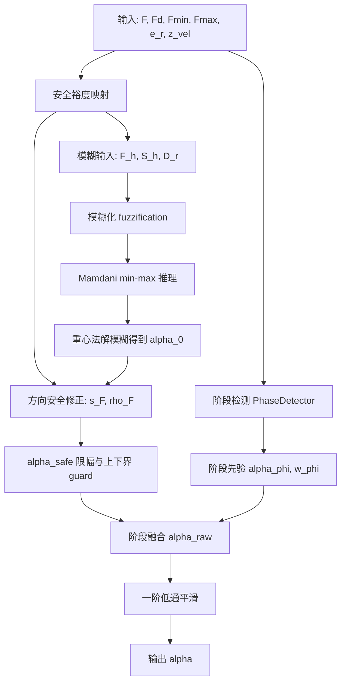
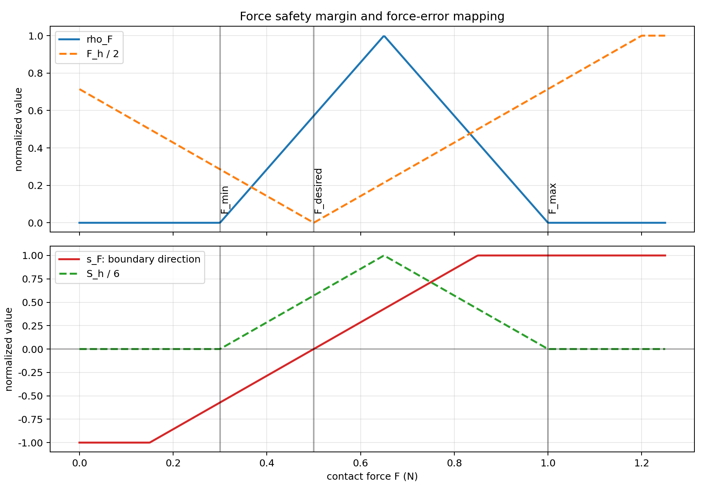
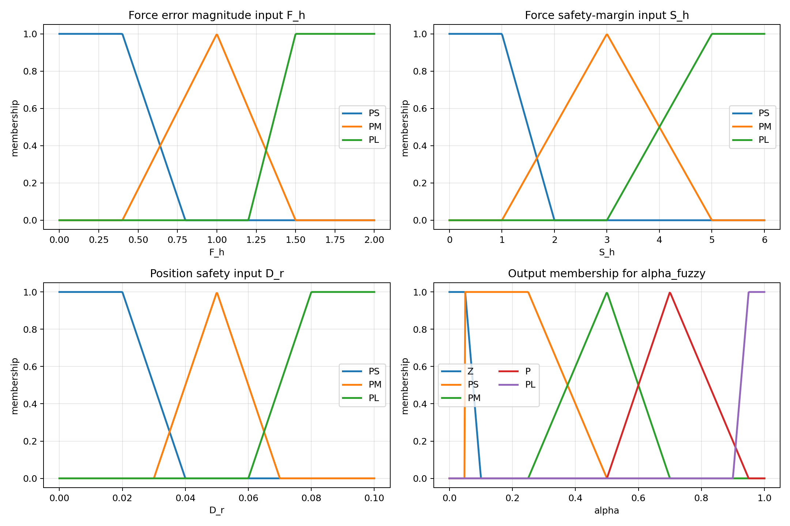
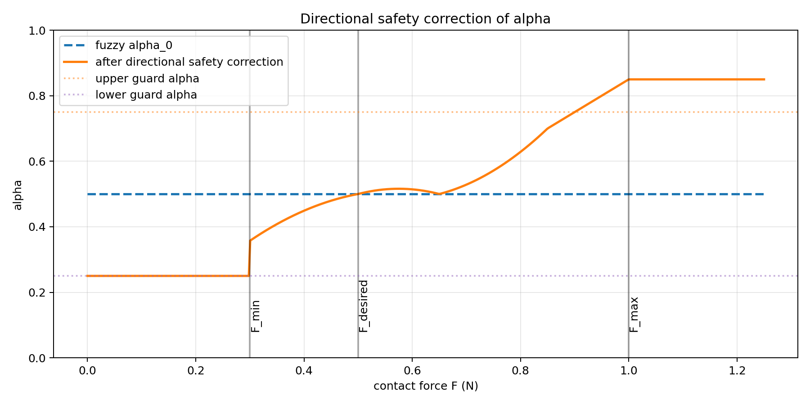
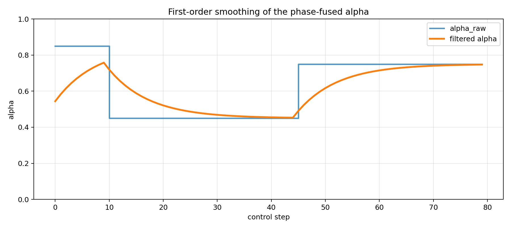

# ForceMarginFuzzyAlphaScheduler 方法阐述

<style>
body,
.markdown-body {
    background: #ffffff !important;
    color: #111111;
}
</style>

本文档给出 `ForceMarginFuzzyAlphaScheduler` 的数学语言描述。该策略实现于：

```text
tests/cooperative_gt_0428/src/alpha_scheduler_gt.py
```

其策略名为：

```text
force_margin_alpha
```

该方法用于合作博弈力-位控制器中的仲裁参数 `alpha` 在线调度。`alpha` 的物理意义为：

```text
alpha -> 1: 位置/轨迹/RCM 几何约束优先
alpha -> 0: 接触力调节优先
```

在控制器中，`alpha` 进入 ARE 权重混合：

```math
Q_\alpha =
\operatorname{diag}
\left(
\alpha q_{r1},
\alpha q_{r2},
(1-\alpha)q_f,
(1-\alpha)q_{\sigma f}
\right)
```

因此，`alpha` 越大，位置误差项权重越高；`alpha` 越小，力误差项和力误差积分项权重越高。

## 1. 方法总览

`ForceMarginFuzzyAlphaScheduler` 的核心思想是：不直接依赖环境刚度估计作为仲裁依据，而是根据当前接触力距离安全上下界的裕度决定仲裁权重。

接触力处于安全区间中部时，允许力-位控制平衡；接触力接近上界时，提高 `alpha`，使系统更偏位置保持，避免继续压入；接触力接近下界时，降低 `alpha`，增强力控制，避免脱离接触。

整体计算流程如下：



对应配图如下：



## 2. 输入与符号定义

每个控制周期调用：

```python
alpha = scheduler.compute(
    F_norm=abs(F_z),
    e_f=e_f_scalar,
    K_hat=K_hat,
    e_r=e_r_scalar,
    z_vel=tv[2],
    de_f=e_f_dot,
    dK=dK,
    de_r=de_r,
    F_desired=cfg.F_desired,
    F_min=cfg.F_min,
    F_max=cfg.F_max,
)
```

其中实际参与 `ForceMarginFuzzyAlphaScheduler` 核心计算的变量为：

| 符号 | 代码变量 | 含义 |
|---|---|---|
| `F` | `F_norm` | 当前接触力范数，当前实验中通常为 `abs(F_z)` |
| `F_d` | `F_desired` | 期望接触力 |
| `F_min` | `F_min` | 接触力安全下界 |
| `F_max` | `F_max` | 接触力安全上界 |
| `e_r` | `e_r` | tool 平面位置误差范数 |
| `v_z` | `z_vel` | tool z 方向速度，用于阶段检测 |

在当前控制脚本中，力误差统一定义为：

```math
e_f = F - F_d
```

即：

```text
e_f > 0: 实际接触力大于期望力
e_f < 0: 实际接触力小于期望力
```

## 3. 安全裕度与方向变量

定义力安全区间宽度：

```math
W = \max(F_{max}-F_{min}, \epsilon)
```

半宽：

```math
H = \max\left(\frac{W}{2}, \epsilon\right)
```

代码中：

```python
width = max(F_max - F_min, 1e-6)
half_width = max(0.5 * width, 1e-6)
```

到下界和上界的距离分别为：

```math
d_{lower} = F - F_{min}
```

```math
d_{upper} = F_{max} - F
```

归一化安全裕度定义为：

```math
\rho_F =
\operatorname{clip}
\left(
\frac{\min(d_{lower}, d_{upper})}{H},
0,
1
\right)
```

解释：

```text
rho_F = 1: 接触力位于安全区间中部，远离上下界
rho_F = 0: 接触力接近边界或已经越界
```

为了区分“偏大风险”和“偏小风险”，定义方向变量：

```math
s_F =
\operatorname{clip}
\left(
\frac{F-F_d}{H},
-1,
1
\right)
```

解释：

```text
s_F > 0: 实际力偏大，需要提高 alpha，减少继续压入
s_F < 0: 实际力偏小，需要降低 alpha，增强力控补偿
s_F = 0: 实际力接近期望力
```

## 4. 模糊输入映射

调度器将连续物理量映射为三个模糊输入：

```math
(F_h, S_h, D_r)
```

### 4.1 力误差幅值输入 `F_h`

```math
F_h =
\operatorname{clip}
\left(
\frac{2|F-F_d|}{F_{max}-F_{min}},
0,
2
\right)
```

`F_h` 描述当前力误差大小，论域为 `[0, 2]`。

### 4.2 安全裕度输入 `S_h`

```math
S_h = 6\rho_F
```

`S_h` 描述当前力距离安全边界的裕度，论域为 `[0, 6]`。

### 4.3 位置安全输入 `D_r`

```math
D_r =
\operatorname{clip}
\left(
0.1 - |e_r|\frac{0.1}{0.005},
0,
0.1
\right)
```

`D_r` 是位置误差的反向映射：

```text
位置误差小 -> D_r 大 -> 可给力控更多空间
位置误差大 -> D_r 小 -> 应提高 alpha 保护位置跟踪
```

## 5. 隶属函数

方法使用三类基础隶属函数。

### 5.1 三角隶属函数

对参数 `(a,b,c)`：

```math
\mu_{\triangle}(x;a,b,c)=
\begin{cases}
0, & x \le a \ \text{or}\ x \ge c \\
\frac{x-a}{b-a}, & a < x \le b \\
\frac{c-x}{c-b}, & b < x < c
\end{cases}
```

### 5.2 左肩隶属函数

```math
\mu_L(x;a,b,c)=
\begin{cases}
0, & x<a \\
1, & a \le x \le b \\
\frac{c-x}{c-b}, & b < x < c \\
0, & x \ge c
\end{cases}
```

### 5.3 右肩隶属函数

```math
\mu_R(x;a,b,c)=
\begin{cases}
0, & x \le a \\
\frac{x-a}{b-a}, & a < x < b \\
1, & b \le x \le c \\
0, & x > c
\end{cases}
```

代码中标签 `PS` 和输出标签 `Z` 使用左肩函数，标签 `PL` 使用右肩函数，其余标签使用三角函数。



### 5.4 输入模糊集

`F_h` 的模糊集：

| 标签 | 语义 | 参数 |
|---|---|---|
| `PS` | force error small | `(0.0, 0.4, 0.8)` |
| `PM` | force error medium | `(0.4, 1.0, 1.5)` |
| `PL` | force error large | `(1.2, 1.5, 2.0)` |

`S_h` 的模糊集：

| 标签 | 语义 | 参数 |
|---|---|---|
| `PS` | safety margin small, near boundary | `(0.0, 1.0, 2.0)` |
| `PM` | safety margin medium | `(1.0, 3.0, 5.0)` |
| `PL` | safety margin large, safe middle region | `(3.0, 5.0, 6.0)` |

`D_r` 的模糊集：

| 标签 | 语义 | 参数 |
|---|---|---|
| `PS` | position safety small, position error large | `(0.0, 0.02, 0.04)` |
| `PM` | position safety medium | `(0.03, 0.05, 0.07)` |
| `PL` | position safety large, position error small | `(0.06, 0.08, 0.1)` |

输出 `alpha_fuzzy` 的模糊集：

| 标签 | 语义 | 参数 |
|---|---|---|
| `Z` | very small alpha | `(0.0, 0.05, 0.1)` |
| `PS` | small alpha | `(0.05, 0.25, 0.5)` |
| `PM` | medium alpha | `(0.25, 0.5, 0.7)` |
| `P` | positive / moderately large alpha | `(0.5, 0.7, 0.95)` |
| `PL` | large alpha | `(0.9, 0.95, 1.0)` |

## 6. 模糊推理

模糊化后，输入隶属度记为：

```math
\mu_{F}^{i}(F_h),\quad
\mu_{S}^{j}(S_h),\quad
\mu_{D}^{k}(D_r)
```

其中：

```math
i,j,k \in \{PS, PM, PL\}
```

每条规则采用 Mamdani 最小激活：

```math
\lambda_{ijk}
=
\min
\left(
\mu_{F}^{i}(F_h),
\mu_{S}^{j}(S_h),
\mu_{D}^{k}(D_r)
\right)
```

同一个输出标签可能被多条规则激活，采用最大合成：

```math
\mu_{out}^{l}
=
\max_{(i,j,k)\rightarrow l}
\lambda_{ijk}
```

其中 `l` 是输出标签：

```math
l \in \{Z, PS, PM, P, PL\}
```

## 7. 规则表

规则写作：

```text
IF F_h is A AND S_h is B AND D_r is C THEN alpha is Y
```

完整规则如下，与代码 `rule_dict` 一一对应。

### 7.1 `F_h = PS`

| `S_h` | `D_r=PS` | `D_r=PM` | `D_r=PL` |
|---|---:|---:|---:|
| `PS` | `PL` | `P` | `PM` |
| `PM` | `PL` | `P` | `PM` |
| `PL` | `P` | `PM` | `PM` |

解释：力误差较小时，如果位置安全度低，即 `D_r=PS`，说明位置误差大，需要高 `alpha`；如果位置误差小，则允许中等 `alpha`。

### 7.2 `F_h = PM`

| `S_h` | `D_r=PS` | `D_r=PM` | `D_r=PL` |
|---|---:|---:|---:|
| `PS` | `PL` | `P` | `PS` |
| `PM` | `P` | `PM` | `PS` |
| `PL` | `P` | `PM` | `PS` |

解释：力误差中等时，若位置误差大仍偏高 `alpha`；若位置误差小，则允许更低 `alpha` 参与力调节。

### 7.3 `F_h = PL`

| `S_h` | `D_r=PS` | `D_r=PM` | `D_r=PL` |
|---|---:|---:|---:|
| `PS` | `PL` | `PM` | `Z` |
| `PM` | `P` | `PS` | `Z` |
| `PL` | `P` | `PS` | `Z` |

解释：力误差较大且位置误差小的时候，模糊输出可能很低，即强力控修正；但若位置误差大，仍给较高 `alpha`，防止轨迹/RCM 几何失控。

## 8. 解模糊

输出论域离散化为：

```math
z \in \{0, 0.01, 0.02, \dots, 1.0\}
```

每个 `z` 处的综合输出隶属度为：

```math
\mu_{total}(z)
=
\max_l
\min
\left(
\mu_{out}^{l},
\mu_l(z)
\right)
```

采用重心法得到初始模糊仲裁：

```math
\alpha_0
=
\frac
{\sum_z z \mu_{total}(z)}
{\sum_z \mu_{total}(z)}
```

若分母接近零，则代码返回默认值：

```math
\alpha_0 = 0.5
```

## 9. 方向安全修正

模糊推理得到的 `alpha_0` 只知道力误差大小和安全裕度，但方向性不足。因此调度器进一步使用 `s_F` 对 `alpha` 做方向安全修正。

定义边界风险：

```math
r_F = 1 - \rho_F
```

当力接近边界或越界时，`r_F` 增大；当力位于安全区间中部时，`r_F` 接近 0。

安全修正为：

```math
\alpha_{safe}
=
\alpha_0
+ k_{upper} r_F \max(s_F,0)
- k_{lower} r_F \max(-s_F,0)
```

代码默认：

```text
k_upper = 0.35
k_lower = 0.25
```

解释：

```text
s_F > 0: 力偏大，alpha_safe 增大，控制更偏位置保持，减少继续压入
s_F < 0: 力偏小，alpha_safe 减小，控制更偏力调节，避免脱离接触
```

随后加入硬安全保护：

```math
F \ge F_{max}
\Rightarrow
\alpha_{safe}
=
\max(\alpha_{safe}, \alpha_{upper})
```

```math
F \le F_{min}
\Rightarrow
\alpha_{safe}
=
\min(\alpha_{safe}, \alpha_{lower})
```

默认：

```text
alpha_upper = 0.75
alpha_lower = 0.25
```

最后限幅：

```math
\alpha_{safe}
=
\operatorname{clip}
\left(
\alpha_{safe},
\alpha_{min},
\alpha_{max}
\right)
```

默认：

```text
alpha_min = 0.05
alpha_max = 0.95
```

安全修正示意如下：



## 10. 阶段检测与阶段先验融合

调度器还包含阶段检测器 `PhaseDetector`。阶段由接触力和 z 方向速度决定：

| 阶段 | 条件 | 含义 |
|---|---|---|
| `FREE_SPACE` | `F < F_thresh` 且 `v_z >= -0.001` | 自由空间 |
| `APPROACHING` | `F < F_thresh` 且 `v_z < -0.001` | 接近阶段 |
| `CONTACT_TRANSIENT` | `F >= F_thresh` 且接触时间 `< T_transient` | 接触瞬态 |
| `CONTACT_STEADY` | `F >= F_thresh` 且接触时间 `>= T_transient` | 稳态接触 |
| `RETREAT` | 外部调用 `set_retreat(True)` | 撤退阶段 |

当前阶段先验参数为：

| 阶段 | `alpha_phi` | `w_phi` |
|---|---:|---:|
| `FREE_SPACE` | `1.00` | `1.00` |
| `APPROACHING` | `0.85` | `0.60` |
| `CONTACT_TRANSIENT` | `0.35` | `0.50` |
| `CONTACT_STEADY` | `0.50` | `0.00` |
| `RETREAT` | `1.00` | `1.00` |

阶段融合公式：

```math
\alpha_{raw}
=
w_\phi \alpha_\phi
+
(1-w_\phi)\alpha_{safe}
```

随后限幅：

```math
\alpha_{raw}
=
\operatorname{clip}
(\alpha_{raw}, 0.01, 0.99)
```

解释：

```text
自由空间和撤退阶段完全采用阶段先验 alpha=1，优先保证运动安全。
接近和接触瞬态阶段部分采用阶段先验，避免刚接触时模糊推理过激。
稳态接触阶段 w_phi=0，完全交给 force-margin 模糊安全仲裁。
```

## 11. 一阶平滑

为了避免 `alpha` 在控制周期之间突变，最终输出经过一阶低通滤波：

```math
\alpha_k
=
\alpha_{k-1}
+
\beta
(\alpha_{raw,k}-\alpha_{k-1})
```

其中：

```math
\beta =
\operatorname{clip}
\left(
\frac{dt}{\max(\tau_s,dt)},
0,
1
\right)
```

代码默认：

```text
dt = 0.01 s
smooth_tau = 0.08 s
```

因此：

```math
\beta = \frac{0.01}{0.08}=0.125
```

平滑效果示意：



## 12. 完整算法

单个控制周期的完整算法可写为：

```text
Input:
  F, Fd, Fmin, Fmax, e_r, v_z

1. PhaseDetector:
   phase <- update(F, v_z)
   (alpha_phi, w_phi) <- phase_params[phase]

2. Force-margin mapping:
   W <- max(Fmax - Fmin, eps)
   H <- max(W / 2, eps)
   rho_F <- clip(min(F - Fmin, Fmax - F) / H, 0, 1)
   s_F <- clip((F - Fd) / H, -1, 1)
   F_h <- clip(2 * |F - Fd| / W, 0, 2)
   S_h <- 6 * rho_F
   D_r <- clip(0.1 - |e_r| * 0.1 / 0.005, 0, 0.1)

3. Fuzzification:
   compute memberships of F_h, S_h, D_r

4. Mamdani inference:
   rule activation <- min(input memberships)
   output membership <- max(rule activations)

5. Defuzzification:
   alpha_0 <- centroid(output membership)

6. Directional safety correction:
   r_F <- 1 - rho_F
   alpha_safe <- alpha_0
                 + k_upper * r_F * max(s_F, 0)
                 - k_lower * r_F * max(-s_F, 0)
   if F >= Fmax:
       alpha_safe <- max(alpha_safe, upper_guard_alpha)
   if F <= Fmin:
       alpha_safe <- min(alpha_safe, lower_guard_alpha)
   alpha_safe <- clip(alpha_safe, alpha_min, alpha_max)

7. Phase fusion:
   alpha_raw <- w_phi * alpha_phi + (1 - w_phi) * alpha_safe
   alpha_raw <- clip(alpha_raw, 0.01, 0.99)

8. Smoothing:
   alpha <- alpha_prev + beta * (alpha_raw - alpha_prev)

Output:
  alpha
```

## 13. 与传统模糊仲裁的区别

旧的 `PhaseAwareFuzzyAlphaScheduler` 使用：

```math
(|e_f|, \hat K_e, |e_r|)
```

作为模糊输入，其中 `\hat K_e` 是环境刚度估计。

`ForceMarginFuzzyAlphaScheduler` 改为使用：

```math
(F_h, S_h, D_r)
```

其中关键变量是力安全裕度：

```math
\rho_F =
\operatorname{clip}
\left(
\frac{\min(F-F_{min},F_{max}-F)}{(F_{max}-F_{min})/2},
0,
1
\right)
```

优势是：

1. 直接围绕安全上下界决策，不依赖刚度估计收敛速度。
2. 能区分过压风险和脱离接触风险。
3. 通过阶段先验避免自由空间和接触瞬态下的过激仲裁。
4. 通过一阶平滑降低 `alpha` 抖动对力矩命令的影响。

## 14. 参数建议

对于当前 RCM 实验，典型配置为：

```python
F_desired = 0.5
F_min = 0.3
F_max = 1.0
```

若实验表现为力峰值过大，可考虑：

```text
增大 k_upper
增大 upper_guard_alpha
降低 F_max
增大 smooth_tau
降低扫描速度 scan_vx
```

若实验表现为接触容易丢失，可考虑：

```text
增大 k_lower
降低 lower_guard_alpha
提高 F_min
适当降低 alpha_end 或固定策略中的 alpha
```

若位置误差或 RCM 误差偏大，可考虑：

```text
提高 D_r 对位置误差的敏感度
增大 CONTACT_TRANSIENT 阶段的 alpha_phi
提高 alpha_min
缩短扫描区间或降低 scan_vx
```

## 15. 当前实现对应关系

| 文档变量 | 代码位置 |
|---|---|
| `F_h, S_h, D_r, rho_F, s_F` | `_force_margin_inputs(...)` |
| 隶属函数 | `_membership(...)`, `_triangular_mf(...)`, `_left_shoulder_mf(...)`, `_right_shoulder_mf(...)` |
| 模糊化 | `_fuzzify(...)` |
| Mamdani 推理 | `_infer(...)` |
| 重心法解模糊 | `_defuzzify_alpha(...)` |
| 方向安全修正 | `compute(...)` 中的 `alpha_safe` |
| 阶段融合 | `alpha_raw = w_phi * alpha_phi + ...` |
| 一阶平滑 | `alpha = self._alpha_filt + self.smooth_beta * ...` |
